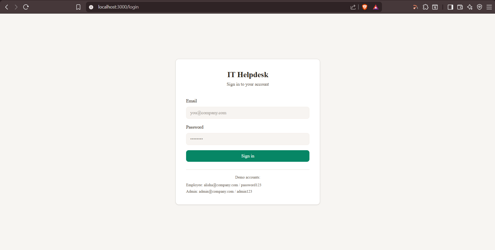
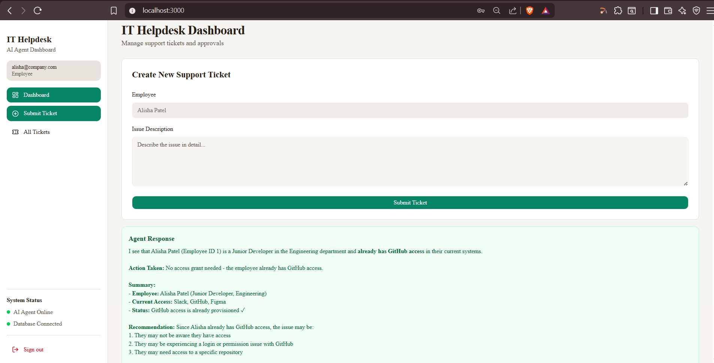
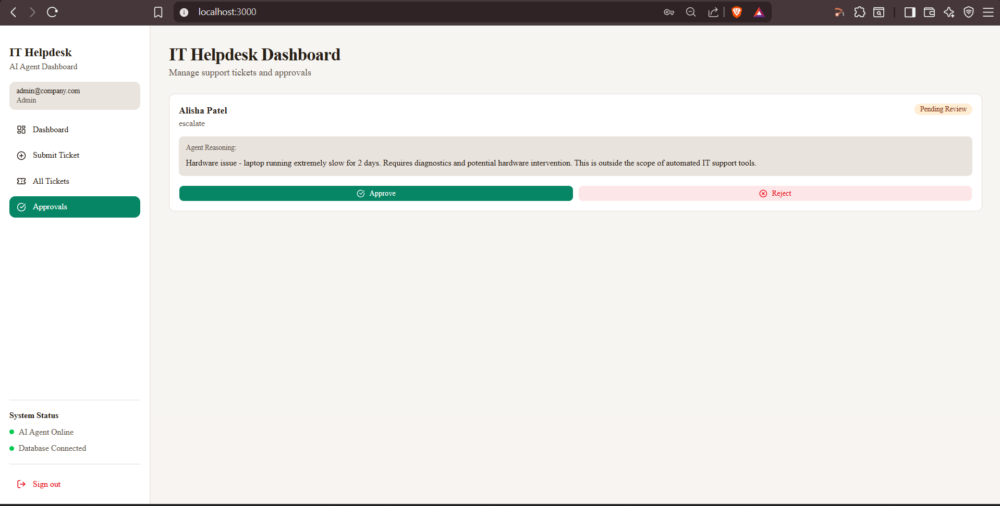
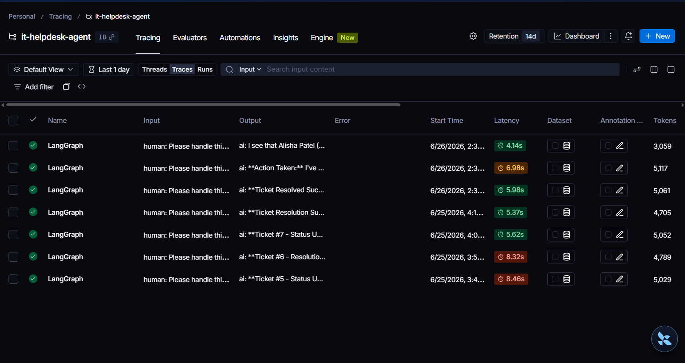

# IT Helpdesk AI Agent

An agentic AI system that autonomously handles employee IT support tickets. The agent reads incoming requests, decides what action to take, executes low-risk actions automatically, and routes medium and high-risk actions through a human approval workflow before anything irreversible happens.

## Problem Statement

Most companies have IT helpdesk teams that spend the majority of their time on repetitive, low-risk tickets: password resets, software access requests, and routine escalations. These tickets sit in a queue waiting for a human even when the resolution is straightforward. There is no reliable system that can safely decide which tickets to auto-resolve and which genuinely need a person, without risking the agent doing something it shouldn't.

This project solves that. The agent handles what it can automatically, queues what needs approval, and always escalates what is too risky to touch, with a clear audit trail for every decision.

## Screenshots

### Login


### Employee View


### My Tickets


### Admin Approvals


### LangSmith Traces


## How It Works

An employee logs in and submits a ticket describing their issue. The LangGraph agent reads the ticket, looks up the employee, identifies what action is needed, and decides based on risk level:

- **Low risk** (Slack, Figma, Jira access) → executes automatically, ticket resolved instantly
- **Medium risk** (GitHub access, password resets) → queued for IT admin approval with agent reasoning attached
- **High risk** (AWS Console, Payroll System) → always escalated, human must review
- **Hardware or unclear issues** → escalated with diagnosis context written by the agent

IT admins see a separate dashboard showing only pending approvals with the agent's reasoning, and can approve or reject with one click. Employees only see their own tickets.

## Architecture

```
Employee submits ticket
        ↓
FastAPI backend receives request
        ↓
LangGraph agent (claude-haiku-4-5)
    → look_up_employee
    → check_ticket_status
    → grant_software_access / reset_password / escalate_to_human
        ↓
Risk tier decision
    → Low:    execute immediately
    → Medium: create PendingApproval record
    → High:   escalate with reasoning
        ↓
IT admin reviews pending approvals in dashboard
    → Approve → action executes, ticket resolved
    → Reject  → ticket marked rejected
        ↓
LangSmith logs full trace of every agent decision
```

## Tech Stack

| Layer | Technology |
|---|---|
| Agent | LangGraph, LangChain, Claude Haiku |
| Backend | FastAPI, SQLAlchemy ORM, SQLite |
| Frontend | Next.js, Tailwind CSS, shadcn/ui |
| Auth | JWT tokens, bcrypt password hashing |
| Observability | LangSmith |
| Language | Python, TypeScript |

## Project Structure

```
support-agent/
  backend/
    app/
      models.py        # Database schema (Employee, Ticket, PendingApproval, User)
      tools.py         # Agent tool functions with risk-tiered logic
      agent_tools.py   # LangChain StructuredTool wrappers
      agent.py         # LangGraph agent graph and processing logic
      main.py          # FastAPI endpoints with JWT auth
      seed.py          # Database seeding script
  frontend-next/
    app/
      page.tsx         # Main dashboard page
      login/
        page.tsx       # Login page
    components/
      dashboard/       # Tickets list, approvals list, ticket form, nav
```

## Setup

**Prerequisites:** Python 3.10+, Node.js 18+, Anthropic API key, LangSmith API key

**Backend:**
```bash
cd backend/app
python -m venv venv
source venv/bin/activate  # Windows: venv\Scripts\activate
pip install -r ../requirements.txt
python seed.py
uvicorn main:app --reload --port 8000
```

**Frontend:**
```bash
cd frontend-next
npm install
npm run dev
```

**Environment variables** (`.env` in project root):
```
ANTHROPIC_API_KEY=your_key
LANGCHAIN_TRACING_V2=true
LANGCHAIN_ENDPOINT=https://api.smith.langchain.com
LANGCHAIN_API_KEY=your_langsmith_key
LANGCHAIN_PROJECT=it-helpdesk-agent
SECRET_KEY=your-random-secret-key
```

Open `http://localhost:3000`

**Demo accounts:**
```
Employee: alisha@company.com / password123
Admin:    admin@company.com / admin123
```

## Key Engineering Decisions

**Risk-tiered tool execution.** The agent cannot grant AWS or Payroll access autonomously. The code prevents it at the tool level, not just through prompting. This is the difference between a safe production system and a demo that happens to work.

**Human-in-the-loop approval gate.** Every medium and high-risk action creates a PendingApproval record with the agent's reasoning attached before anything executes. The IT admin sees exactly why the agent wants to take an action before approving it.

**Role-based access control.** Employees only see their own tickets. Admins see everything. The approvals panel is completely inaccessible to non-admin users, enforced at both the API and UI level.

**JWT authentication.** Stateless token-based auth means the system scales cleanly. Tokens carry the user's role and employee ID, so every API call is self-contained without requiring a database lookup for auth.

**LangGraph over a basic agent loop.** Using a state graph gives explicit control over the agent's decision flow, making it inspectable, debuggable, and extensible. Each node is a discrete step with clear inputs and outputs visible in LangSmith traces.

**Audit trail by design.** Every action, approved or rejected, is persisted with timestamps and agent reasoning. This is a real production requirement for any system that touches access control.